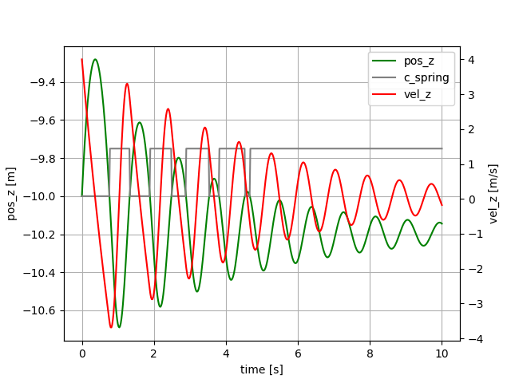

# Tethers.jl
A series of examples, from a simple falling mass towards a tether model, consisting of point masses connected by spring damper elements with support of reel-out and reel-in and aerodynamic
drag attached.

-- WORK IN PROGRESS --

## Installation

1. make sure you are running a `bash` terminal (shell) and you have at least 16GB RAM (MAC, Linux and Windows supported).  
   On Windows, you can use [git for windows](https://gitforwindows.org/) which provides git AND a bash shell, but for using Julia from a `bash` terminal you must also install either  [Installation and usage of VSCode](docs/images/vscode.md) or [Windows Terminal](https://learn.microsoft.com/en-us/windows/terminal/install). `Windows Terminal` is the simple and clean solution, `VSCode` the comfortable, fancy solution.
2. install Julia 1.10 using `juliaup`, see [https://github.com/JuliaLang/juliaup](https://github.com/JuliaLang/juliaup). If `juliaup` is already installed, the following commands will do:
```
juliaup add 1.10
juliaup default 1.10 
```

Check out from git:
```bash
cd repos # any folder of your choice, but without spaces in the folder name
git clone https://github.com/ufechner7/Tethers.jl
```

Build the system image:
```bash
cd repos/Tethers.jl
cd bin
./create_sys_image
```

## Basic example
Use the provided script to start Julia from the `Tethers.jl` folder:
```bash
cd repos/Tethers.jl
./bin/run_julia
```
From the Julia prompt, run the simulation:
```julia
include("src/Tether_01.jl")
```
You should see a plot similar to:


This example shows a mass that is thrown upwards, slows down and then falls.

**Julia code:** [Tether_01.jl](src/Tether_01.jl)

These differential equations define the model:
```Julia
D = Differential(t)

eqs = vcat(D.(pos) ~ vel,
           D.(vel) ~ acc,
           acc    .~ G_EARTH)
```
The term `D.(pos)` means "Apply the differential D(t) to all elements of the vector `pos`".
The second term defines that the differential of the velocity vector must be equal to the 
acceleration. For equality in symbolic equations the character `~` has to be used, because
the character `=` has the meaning "assign a value to a variable" which is not what we are doing here. The third equation means that all elements of the acceleration vector must be equal
to the elements of the gravity vector. We end up with an array of `3x3`` equations.

The next lines are:
```julia
@named sys = ODESystem(eqs, t)
simple_sys = structural_simplify(sys)
```
This means, we create a named ordinary equation system, depending on `t`. Then we simplify
the system symbolically (order reduction). If you type `sys` in the Julia REPL (command line)
you can see that the original system had 9 equations, the second line above created a system
with ony six equations. This step helps to speed up the simulation and often also removes
algebraic loops which makes the ODE a lot simple to solve numerically later on.

## Python version as comparison
From the Julia prompt execute:
```
include("src/RunTether.jl")
```
This will install Python and Matplotlib and Assimulo and execute the script `Tether_01.py`.

**Python code:** [Tether_01.py](src/Tether_01.py)

If you compare the Python and the Julia script you can see that:
- the Julia script is shorter and easier to read
- Julia is about 16 times faster when running the simulation

## More examples
### Mass, attached to a spring damper element
From the Julia prompt, run the simulation:
```julia
include("src/Tether_02.jl")
```


Mass, attached to a spring damper element. One end of the spring at the origin, the second end
attached to the mass. Mass initially below the origin, spring un-stretched. Z-axis pointing
upwards.

**Julia code:** [Tether_02.jl](src/Tether_02.jl)

### Mass, attached to a non-linear spring damper element
```julia
include("src/Tether_03.jl")
```


Mass, attached to a spring damper element. One end of the spring at the origin, the second end
attached to the mass. Mass initially below the origin, spring un-stretched. Z-axis pointing
upwards. 

Initial velocity $4 m/s$ upwards. The compression stiffness is zero. The grey line shows that
the stiffness is zero at the beginning, and has the nominal value at the end. **Example:** [Tether_03.jl](https://github.com/ufechner7/Tethers.jl/blob/main/src/Tether_03.jl).

Thanks to the package [ModelingToolkit.jl](https://docs.sciml.ai/ModelingToolkit/stable/) the system description is very compact and readable:
```Julia
D = Differential(t)
eqs = vcat(D.(pos)      ~ vel,
           D.(vel)      ~ acc,
           norm1        ~ norm(pos),
           unit_vector  ~ -pos/norm1,         # direction from point mass to origin
           spring_vel   ~ -unit_vector ⋅ vel,
           c_spring     ~ c_spring0 * (norm1 > abs(l0)),
           spring_force ~ (c_spring * (norm1 - abs(l0)) + damping * spring_vel) * unit_vector,
           acc          ~ G_EARTH + spring_force/mass)
```

The same as Python version: **Python code:** [Tether_03.py](src/Tether_03.py). 

#### Using a callback
By using a callback to detect exactly when the transition from a stiff tether segment to a loose
tether segment happens we can increase the accuracy of the simulation. **Julia code:** [Tether_03b.jl](src/Tether_03b.jl).

We only have to add the following lines of code:
```julia
function condition(u, t, integrator) # Event when condition(u,t,integrator) == 0
    norm(u[1:3]) - abs(L0)
end
`function affect!(integrator)
    println(integrator.t)            # Not needed, just to show that the callback works
end
cb = ContinuousCallback(condition, affect!)
```
and add the parameter `callback = cb` to the line that calls the solver:
```julia
sol = solve(prob, Rodas5(), dt=dt, abstol=tol, reltol=tol, saveat=ts, callback = cb)
```

#### Using a callback with Python
In Python you would have to add the following attribute:
```Python
    sw0 = [vel_1[2] > 0] # array of booleans; true means the tether segment is loose (l < l_0)
```
and the following methods:
```Python
    def state_events(self, t, y, yd, sw):
        """
        This is our function that keeps track of our events. When the sign
        of any of the events has changed, we have an event.
        """
        # calculate the norm of the vector from mass1 to mass0 minus the initial segment length
        event_0 = np.linalg.norm(y[3:6]) - L_0
        return np.array([event_0])
    
    def handle_event(self, solver, event_info):
        """
        Event handling. This functions is called when Assimulo finds an event as
        specified by the event functions.
        """
        state_info = event_info[0] # We are only interested in state events
        if state_info[0] != 0:     # Check if the first event function has been triggered
            if solver.sw[0]:       # If the switch is True the pendulum bounces
                print(solver.t)
```
**Example:** [Tether_03b.py](src/Tether_03b.py).  
As you can see, logging of calculated variables is not
possible with Assimulo (easy with ModelingToolkit in Julia). You need to re-calculate them
after the simulation.

#### Multi-segment tether
Using 2D arrays of variables allows to simulate a multi-segment tether:
```julia
@variables pos(t)[1:3, 1:segments+1]  = POS0
@variables vel(t)[1:3, 1:segments+1]  = VEL0
@variables acc(t)[1:3, 1:segments+1]  = ACC0
```
In this case it is important to calculate the initial conditions of each particle such that they are physically feasible:
```julia
G_EARTH     = Float64[0.0, 0.0, -9.81]          # gravitational acceleration     [m/s²]
L0::Float64 = 10.0                              # initial segment length            [m]
V0::Float64 = 4                                 # initial velocity of lowest mass [m/s]
segments::Int64 = 2                             # number of tether segments         [-]
POS0 = zeros(3, segments+1)
VEL0 = zeros(3, segments+1)
ACC0 = zeros(3, segments+1)
SEGMENTS0 = zeros(3, segments) 
UNIT_VECTORS0 = zeros(3, segments)
for i in 1:segments+1
    POS0[:, i] .= [0.0, 0, -(i-1)*L0]
    VEL0[:, i] .= [0.0, 0, (i-1)*V0/segments]
end
for i in 2:segments+1
    ACC0[:, i] .= G_EARTH
end
for i in 1:segments
    UNIT_VECTORS0[:, i] .= [0, 0, 1.0]
    SEGMENTS0[:, i] .= POS0[:, i+1] - POS0[:, i]
end
```
The first example of such a model is the script [Tether_04.jl](src/Tether_04.jl) which is derived from the last example.

In the script [Tether_05.jl](src/Tether_05.jl) the spring force is distributed correctly on the two masses attached to the spring as shown here:
```julia
if i == segments
    eqs2 = vcat(eqs2, total_force[:, i] ~ spring_force[:, i])
else
    eqs2 = vcat(eqs2, total_force[:, i] ~ spring_force[:, i]- spring_force[:, i+1])
end
```
We loop backwards over the particles, starting with the last particle, because on the last particle only one force is acting. On particle $n-1$ two spring forces are acting in the opposite direction.

Finally in this example we plot the result dynamically as 2D video. Screenshot:


#### Benchmarking
Using a callback slows the simulation down, but not much. Try it out:
```julia
include("src/Tether_03c.jl")
```
Output on a fast PC:
```
Solving the system without callback...
  0.000606 seconds (8.06 k allocations: 257.672 KiB)
Press any key...

Solving the system with callback...
  0.000741 seconds (9.93 k allocations: 365.812 KiB)
If you zoom in to the points in time where pos_z crosses -10m
you should see a difference...
```
In this example the gain of accuracy is very small, but that can be different
in other simulations. For benchmarking we call solve twice: The first call ensures that the
code is compiled, the second call measures the execution time of the code.

**Python**
The script, which executes the Python code with callbacks:
```
include("src/RunTether_03b.jl")
```
reports 31 ms for solving the problem (without printing).
Without callbacks:
```
include("src/RunTether_03.jl")
```
still 20 ms are needed.

## Comparism
Execution time for a simulation of 10s duration with logging the state every 20ms.
| Testcase                    | Lines of code (LOC) Julia | LOC Python  | Time Julia [ms] | Time Python [ms] |
|:----------------------------|:-------------------:|:---:|:-:|:---:|
|Falling mass                 |     42              | 56  | 0.17  | 2.6  |
|Non-linear Spring damper     |     61              | 83  | 0.61  | 20  |
|dito with callbacks          |     68              | 103 | 0.74 | 31  |
|swinging tether, 5 segments  |    117              | 190    | 2.90     |     |

**Tradeoff Julia vs Python:** In Julia the code is compiled before it is executed, that can cause about 1 to 10 seconds delay when running a simulation the first time, but speeds up the execution a lot afterwards. In addition Julia can run fully multithreaded, Python cannot really use threads because of the global interpreter lock. See also: [Why Julia?](https://ufechner7.github.io/2022/08/13/why-julia.html)

## Using Python together with Julia
Python and Julia play very well together. You could see in the examples above that I am using Matplotlib for plotting, both in Python and in Julia. Julia has a build-in package manager. You can use it install and remove Julia packages, but also to install or remove Python packages. That works like this:


**Using Python packages from Julia**
There are three options:

**Option one:** Use wrapper libraries which exist for a few, very popular Python packages, e.g.
[PyPlot.jl](https://github.com/JuliaPy/PyPlot.jl) for Matplotlib or [SymPy.jl](https://github.com/JuliaPy/SymPy.jl) for SymPy. You can install them like any other Julia package, e.g.
```
]     # enter package manager mode
add SymPy
<DEL> # leave the package manager
```
and on the Julia prompt:
```
using SymPy
```

**Option two:**

Use PyCall to use Python packages for Julia. This works for all Python packages, but 
is a little bit less comfortable than option one. Example:

```
using PyCall
np = pyimport("numpy")
```
Now you can use NumPy from Julia:
```julia
julia> np.zeros(3)
3-element Vector{Float64}:
 0.0
 0.0
 0.0
```
If the package is not yet installed, you can use the notation:
```
as = pyimport_conda("assimulo", "assimulo")
```
If the command `using PyCall` should fail, you can execute:
```
cd bin
./build_pycall
```
to re-build it.

**Option three:**
Using the package [PythonCall](https://github.com/JuliaPy/PythonCall.jl).
You cannot use it together with `PyCall`, it is the newer successor of `PyCall`, and it is
symmetric, you can use it to call Julia from Python or Python from Julia.

We need to create a new project to try it out:
```
cd repos # or any other folder that you use for your projects
mkdir PythonDemo
cd PythonDemo
julia --project="." # this creates a new, empty project
```
Then enter at the Julia prompt:
```
]               # enter the package manger mode
add PythonCall
<BACK>          # leave the package manager mode
```
Example for using Python from Julia:
```julia
re = pyimport("re")   # import the re module
words = re.findall("[a-zA-Z]+", "PythonCall.jl is very useful!")
```
Output:
```
Python: ['PythonCall', 'jl', 'is', 'very', 'useful']
```
Type:
```julia
sentence = Py(" ").join(words)
```
Output:
```
Python: 'PythonCall jl is very useful'
```
And finally convert this Python object to a Julia string:
```julia
pyconvert(String, sentence)  # convert the Python string to a Julia string
```
For adding Python packages that you want to use with PythonCall use CondaPkg as explained
in the next section.

**Sometimes needed:** Install CondaPkg
```
] # by pressing the closing square bracket you enter the package manager mode of Julia
add CondaPkg # add the Python package manger

```
Now press the \<DEL\> key to leave the package manager.
In the Julia REPL, type:
```
using CondaPkg
]                 # enter the package manager mode
help              # will show you all available commands; try for example
conda add ipython # this will add ipython
```
Press \<DEL\> to leave the package manager mode.
In the Julia REPL, type:
```
CondaPkg.withenv() do
    run(`ipython`)
end
```
You should now get an interactive Python prompt and can program in Python.

