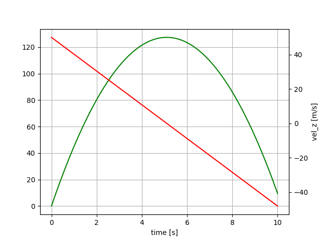

# Tethers.jl
Tether models

## Installation

1. make sure you are running a `bash` terminal (shell) and you have at least 16GB RAM (MAC, Linux and Windows supported).  
   On Windows, you can use [git for windows](https://gitforwindows.org/) which provides git AND a bash shell, but for using Julia from a `bash` terminal you must also install either  [Installation and usage of VSCode](docs/vscode.md) or [Windows Terminal](https://learn.microsoft.com/en-us/windows/terminal/install). `Windows Terminal` is the simple and clean solution, `VSCode` the comfortable, fancy solution.
2. install Julia 1.10 using `juliaup`, see [https://github.com/JuliaLang/juliaup](https://github.com/JuliaLang/juliaup). If `juliaup` is already installed, the following commands will do:
```
juliaup add 1.10
juliaup default 1.10 
```

Check out from git:
```bash
cd repos # any folder of your choice, but without spaces in the folder name
git clone https://github.com/ufechner7/Tethers.jl
```

Build the system image:
```bash
cd repos/Tethers.jl
cd bin
./create_sys_image
```

## Running the simulation
Use the provided script to start Julia from the `Tethers.jl` folder:
```bash
cd repos/Tethers.jl
./bin/run_julia
```
From the Julia prompt, run the simulation:
```julia
include("src/Tether_01.jl")
```
You should see a plot similar to:



This example shows a mass that is thrown upwards, slows down and then falls.

## Running the Python version as comparison
From the Julia prompt execute:
```
include("src/RunTether.jl")
```
This will install Python and Matplotlib and Assimulo and execute the script `Tether_01.py`.

If you compare the Python and the Julia script you can see that:
- the Julia script is shorter and easier to read
- Julia is about 10 times faster when running the simulation