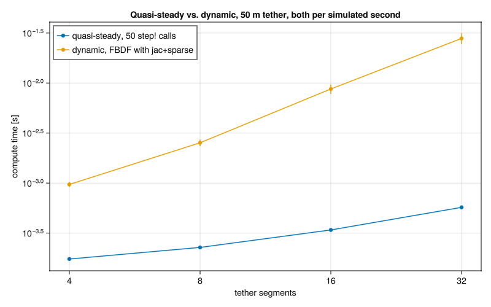

# Quasi-steady tether model: state of the port

Notes on porting the quasi-steady tether model from the `andrea_quasistatic`
branch onto `main`, and on the open questions that port uncovered.

## API

The model lives entirely in the **W (wind) reference frame**, whose origin is the
anchor point of the tether - which is exactly where the model puts the ground
station, at `[0, 0, 0]`. Angles follow the
[KiteUtils.jl reference frames](https://opensourceawe.github.io/KiteUtils.jl/stable/reference_frames/)
convention: **β** is the elevation angle (zero at the horizon, 90° at zenith) and
**φ** is the wind-frame azimuth (positive anti-clockwise seen from above), so the
tether direction at the ground station is `dir ∝ [cos(β)cos(φ), cos(β)sin(φ), sin(β)]`.

The documented, exported API is [`StaticSettings`](@ref), [`Tether`](@ref),
[`init!`](@ref) and [`step!`](@ref), in the submodule `Tethers.QuasiSteady`.
`StaticSettings` carries everything that does not change while a simulation runs -
physical properties, the number of segments, the solver, and the initial condition
(`elevation`, `azimuth`, `l_tether`, `slack`) - following the same shape as
`KiteModels.init!(s::AKM; ...)`, which reads its initial condition from `s.set`
rather than from `init!`'s argument list:

```julia
using StaticArrays
using Tethers.QuasiSteady: StaticSettings, Tether, init!, step!

se = StaticSettings(segments=20, elevation=70.0, l_tether=500.0)
te = Tether(se)
init!(te)                                    # solves the catenary + one step!
for ii in 1:length(gamma)
    step!(te, traj[:, ii], vel[:, ii])       # tether_length defaults from se.slack
    all_force_kite[:, ii] .= te.force_kite
end
```

`te.state_vec` (β, φ, tension) persists between calls and is used as the initial
guess for the next `step!`'s nonlinear solve; `te.tether_pos` and `te.wind_vel` are
pre-allocated buffers reused by every `step!`, so a stepping loop does not allocate
a fresh matrix per iteration. `elevation(te)`, `azimuth(te)` and `tension(te)` read
`te.state_vec` in the KiteUtils vocabulary, in radians.

`simulate_tether` and `init_quasisteady` are the lower-level functions the new API
is built on; they remain callable (qualified, `Tethers.QuasiSteady.simulate_tether`)
for the MATLAB comparison scripts and `test/test_qsm.jl`, but are unexported and no
longer the recommended entry point - see
[docs/src/api.md](https://github.com/ufechner7/Tethers.jl/blob/main/docs/src/api.md)
for their docstrings (kept there only because this project's `checkdocs = :all`
requires every docstring to appear in the manual) and `PlanAPI.md` in the repository
root for the design rationale.

## TODO

Outstanding work, in the order it should be done. Steps 1–4 are the angle
convention; each section linked below holds the detail and the reasoning.

1. ~~**Add the conversion helpers.** Create `src/qsm_conventions.jl` with
   `matlab_to_wind(θ_m, φ_m)` and its inverse `wind_to_matlab(β, φ)`, and
   `include` it from both `src/Tether_quasisteady.jl` and
   `src/Tether_qsm_dual.jl`.~~ **Done** — see `src/qsm_conventions.jl`.
2. ~~**Convert on load.** Apply `matlab_to_wind` to `stateVec` in both copies
   of `get_initial_conditions`. Nothing else in the `.mat` files is
   converted.~~ **Done** — see [It is a parametrisation difference, not a
   frame rotation](#it-is-a-parametrisation-difference-not-a-frame-rotation).
3. ~~**Bring `src/Tether_qsm_dual.jl` in line.** Its `res!` still uses the
   MATLAB parametrisation, so it must move to the elevation/azimuth form used
   by `Tether_quasisteady.jl`.~~ **Done**, and the file has since been deleted
   — see [Removed: the dual-number
   copy](#removed-the-dual-number-copy).
4. ~~**Re-enable the reference comparisons.** Turn the four `@test_broken` in
   `test/test_qsm.jl` back into `@test` with an `rtol`. The reference outputs
   need no conversion.~~ **Done and verified** — all four pass. `rtol=1e-2` was
   tried first and left `T0` failing at ~1.9 %, which is what led to step 5's
   finding; with that closed the tolerance is now `rtol=1e-9` (measured max
   relative error against the reference is ~1e-16 to ~1e-15, i.e. double-precision
   roundoff).
5. ~~**Explain the remaining 1.6 m.**~~ **Done** — it was gravity after all.
   `T.rho_t` in the `.mat` files is a mass per unit length [kg/m], while
   `Settings.rho_tether` is a density [kg/m³], so the tether ran `1/A` = 1442
   times too light. The original MATLAB source was not needed. See [Resolved:
   the remaining 1.6 m was the tether's
   mass](#resolved-the-remaining-16-m-was-the-tethers-mass).
6. ~~**Track down the `maxiters` warning** in `examples/Tether_11.jl`.~~
   **Done** — two independent causes, which is why each survived being tested
   on its own. See [Resolved: the `maxiters`
   warning](#resolved-the-maxiters-warning).
7. ~~**Decide what to do with `transformFromOtoW` / `transformFromWtoO`.**~~
   **Done** — deleted. See [Related: the unused frame
   transforms](#related-the-unused-frame-transforms).

Raise the mirrored azimuth in `test/data/input_basic_test.mat` with whoever
owns the MATLAB code — it is not a blocker, and the fixture should be left
alone. See [Caveat: the fixture's stored azimuth looks
mirrored](#caveat-the-fixtures-stored-azimuth-looks-mirrored).

## Resolved: the angle convention

**The Julia model keeps its own convention; the MATLAB data is converted on
load.** The remaining work is to implement that — see *What to change* below.

### The convention the Julia code uses

The position of the kite is described by two angles, the azimuth angle `φ` and
the elevation angle `β`. The elevation angle is zero when the height of the
kite is zero and 90° when it is at zenith. The azimuth angle is the one in the
wind reference frame, defined **positive anti-clockwise when seen from above**
— the same convention `calc_heading()` and `calc_clock_angle()` use, and the
one written to the log file and the system state from KiteUtils 0.8.2 onwards.
(KiteUtils also knows `azimuth_north`, positive anti-clockwise, and
`azimuth_east`, positive clockwise; neither is used here.)

In this convention the tether direction at the ground station is

```julia
dir ∝ [cos(β)cos(φ), cos(β)sin(φ), sin(β)]
```

which is exactly what `res!` in `src/Tether_quasisteady.jl` already computes,
and what `init_quasisteady` already produces: `phi_init = atan(kite_pos[2],
kite_pos[1])` is anti-clockwise from above, and `theta_init = atan(z, hypot(x,
y))` is an elevation. So the state vector's `θ` **is** the elevation `β`.

### The convention the MATLAB data uses

The reference data in `test/data/` was produced with

```julia
dir ∝ [sin(θ)cos(φ), sin(φ), cos(θ)cos(φ)]
```

where `θ` is measured from the vertical. For
`test/data/input_basic_test.mat` (`θ = 18.435°`, `φ = -17.548°`, `Tn = 160941
N`, kite at `[100, 100, 300]`, 15 segments) the two readings give first
segments pointing in quite different directions:

| | first segment direction | `p0` |
| --- | --- | --- |
| `res!` as written | `[0.905, -0.286, 0.316]` | `[391.18, -123.70, 136.76]` |
| reference data | `[0.302, -0.302, 0.905]` | `[129.36, -129.36, 391.88]` |

The computed tether is a differently-oriented one, not a slightly inaccurate
one: `‖p0 - p0_ref‖ = 365.6 m` on a 431 m tether. Re-running `res!` with the
angles converted into the reference convention drops that to **1.61 m**, which
is what identifies the convention as the cause. A third candidate, the standard
spherical form `[sinθcosφ, sinθsinφ, cosθ]`, is ruled out at 90.0 m. Note that
`[sin(θ)cos(φ), sin(φ), cos(θ)cos(φ)]` and `[sin(θ), tan(φ), cos(θ)]` are the
same vector once normalised, and give identical results.

### It is a parametrisation difference, not a frame rotation

This is what makes the fix cheap. Only the two angles in `stateVec` are
affected; every *vector* quantity in the `.mat` files — `kitePos`, `kiteVel`,
`windVel`, and the reference outputs `p0`, `pj`, `T0` — is already in the same
right-handed, z-up frame the Julia code uses. The reference residual is a plain
componentwise difference of the two:

```
kitePos  [100, 100, 300]           p0_ref  [129.36, -129.36, 391.88]
Fobj_ref [-29.36, 229.36, -91.88]  ==  kitePos - p0_ref     ✓
```

If `p0_ref` were expressed in a y-flipped frame, that identity could not hold.
So there is no handedness flip to undo: MATLAB's `+φ` maps to `+y` just as the
wind-frame azimuth does. Nothing but `stateVec` needs converting, on the way in
or on the way out.

### Tolerance will not paper over this

| | max relative error | rtol needed to pass |
| --- | --- | --- |
| as written | 202 % | `2.02` |
| angles converted (`p0`) | 0.8 % | `0.008` |
| angles converted (`T0`) | 1.9 % | `0.019` |
| angles converted, `rho_t` read as kg/m | — | `1e-6` |

At `rtol = 2.02` the assertion would no longer constrain anything. Only after
the convention is settled does a tolerance become meaningful. The last row is
where this ended up: the 1.6 m turned out to be a second, independent bug (the
section below), and with both fixed the two implementations agree to six
figures rather than two.

### Why the loader and not `res!`

The alternative — changing `res!` to the MATLAB parametrisation — would put a
MATLAB-ism into the public state vector, alter what `state_vec` means for
`init_quasisteady`, `simulate_tether` and all six examples, and force a
conversion at every user-facing edge instead (`calc_heading`,
`calc_clock_angle`, `SysState`). `get_initial_conditions` is the only point at
which MATLAB angle data enters the package, so converting there leaves exactly
one convention in play everywhere else.

### What to change

1. Add the conversion and its inverse — the inverse is wanted as soon as the
   MATLAB reference is re-run to regenerate fixtures. `get_initial_conditions`
   is already duplicated verbatim between `src/Tether_quasisteady.jl` and
   `src/Tether_qsm_dual.jl`, so a small `src/qsm_conventions.jl` that both
   `include` beats a third copy.

   ```julia
   """
       matlab_to_wind(θ_m, φ_m)

   Convert the tether angles at the ground station from the MATLAB reference
   convention, `dir ∝ [sin(θ)cos(φ), sin(φ), cos(θ)cos(φ)]`, to the convention
   used throughout this package: elevation measured up from the horizontal
   plane, azimuth in the wind reference frame, positive anti-clockwise seen
   from above.
   """
   function matlab_to_wind(θ_m, φ_m)
       d = SVec3(sin(θ_m)*cos(φ_m), sin(φ_m), cos(θ_m)*cos(φ_m))
       d /= norm(d)
       return asin(d[3]), atan(d[2], d[1])      # elevation, azimuth
   end
   ```

2. Call it in both copies of `get_initial_conditions`:

   ```julia
   sv = vec(get(vars, "stateVec", 0))
   state_vec = MVector{3}(matlab_to_wind(sv[1], sv[2])..., sv[3])
   ```

3. **Bring `src/Tether_qsm_dual.jl` in line.** Its `res!` still computes
   `FT[1] = Tn·sinθ·cosφ`, `FT[2] = Tn·sinφ`, `FT[3] = Tn·cosθ·cosφ` — the
   MATLAB parametrisation, unconverted. The two implementations of the same
   model therefore disagree with each other today, and both are handed
   `state_vec` from the same loader (`examples/quasisteady/benchmark_qsm_dual.jl`).
   Converting in the loader *requires* this file to move to the
   elevation/azimuth form used by `Tether_quasisteady.jl`. That is an argument
   for the loader rather than against it: it collapses the two onto one
   convention instead of letting them drift further apart.

4. Turn the four `@test_broken` in `test/test_qsm.jl` back into `@test` with an
   `rtol`. The reference outputs need no conversion, per the section above.

### Caveat: the fixture's stored azimuth looks mirrored

Converted, the guess in `input_basic_test.mat` is elevation 64.76°, azimuth
**−45°**. The kite at `[100, 100, 300]` sits at elevation **64.76°**, azimuth
**+45°** — exact elevation match, mirrored azimuth. The MATLAB guess was
evidently generated from `kitePos` using a *clockwise* (`azimuth_east`)
convention, while MATLAB's own residual function treats `+φ` as `+y`, which is
why `p0_ref` has a negative y component.

For a residual unit test this is harmless: both sides evaluate the same input,
and a deliberately off-nominal guess is a reasonable thing to test a residual
at. **Do not flip the sign to make the guess point at the kite** — the stored
`p0_ref` pins the interpretation, and flipping it breaks the comparison. It
does suggest the two conventions are mixed on the MATLAB side too, which is
worth raising with whoever owns that code.

### Related: the unused frame transforms

`transformFromOtoW` / `transformFromWtoO` sat at the end of
`src/Tether_quasisteady.jl` as dead code — defined, never called, never
exported — and their matrix carried both a y-flip and a z-flip, which is a
second convention in a file whose first one had just taken this much work to
pin down. They have been deleted rather than reconciled: nothing in the package
rotates by wind direction today, and a transform nobody calls cannot be
verified against anything.

If a wind-direction rotation is needed later, here is what those two were,
since it is not obvious by inspection. Both used the *same* matrix for both
directions, which is only correct if it is an involution, and
`[c s 0; s -c 0; 0 0 -1]` is one: it squares to the identity. Its determinant
is +1, so despite carrying both a y-flip and a z-flip it is a proper rotation —
the two flips cancel. Specifically it is a rotation by 180° about the
horizontal axis at angle `windDirection_rad/2`, i.e. `2nnᵀ - I` for
`n = [cos(wd/2), sin(wd/2), 0]`.

The part that matters for reuse is that it maps `z → -z`: it converts between a
z-up and a z-down frame, which this package's convention is not. The `.mat`
fixtures do carry `ENVMT.windDirection_rad`, so the concept exists in the
reference data; whatever replaces these should be checked against the
convention settled above, and against whether the caller wants z-up on both
sides.

### Reproducing

`get_initial_conditions` now applies both fixes on load — `matlab_to_wind` to
the two angles, and the `/A` to `rho_t` — so this measures what is left:

```julia
using Tethers.QuasiSteady: get_initial_conditions
import Tethers.QuasiSteady as QSM
using LinearAlgebra, MAT
sv, kp, kv, wv, tl, se = get_initial_conditions("test/data/input_basic_test.mat")
ref = matread("test/data/basic_test_results.mat")
Ns = size(wv, 2)
buffers = [zeros(3, Ns) for _ in 1:5]      # only buffers[3] is read, for the positions

_, T0, pj, p0 = QSM.res!(zeros(3), sv, (kp, kv, wv, tl, se, buffers, Ns, true))
se.rho_tether                # 970.0 kg/m³ — the stored 0.6729 kg/m divided by A
norm(p0 .- vec(ref["p0"]))   # was 1.61 m before the rho_t fix
norm(T0 .- vec(ref["T0"]))   # was ~2846 N before it, all of it in z
```

Both norms now sit inside the `rtol=1e-9` the assertions in `test/test_qsm.jl`
use — the measured max relative error is ~1e-16 to ~1e-15, i.e. double-precision
roundoff. To see the historical numbers, bypass the loader: feeding `res!` the raw
`stateVec` angles gives `‖p0 - p0_ref‖ = 365.6 m`, and feeding it `rho_t`
unconverted (`se.rho_tether = 0.6729`) gives the 1.61 m.

## Resolved: the remaining 1.6 m was the tether's mass

TODO step 5, closed without needing the MATLAB source. `T.rho_t` in the `.mat`
fixtures is a **mass per unit length** [kg/m]; `Settings.rho_tether` is a
**density** [kg/m³], which the model multiplies by the cross section itself.
`get_initial_conditions` passed the number through unconverted, so every model
built from these fixtures ran with a tether `1/A` = 1442 times too light — 1.98
N of tether weight instead of 2848 N.

The fixture pins the intended unit down on its own:

```
rho_t / A = 0.6729014779417218 / 6.937129e-4 = 970.00 kg/m³
```

exactly the density of Dyneema, for a cable whose other stored properties (`d =
29.72 mm`, `E = 116 GPa`) are equally Dyneema-like.

### Why gravity had been ruled out

The note above the assertions in `test/test_qsm.jl` excluded gravity by
observing that the gap against `T0` was ~2846 N while *"the model's own gravity
term here totals ~2 N"*. Those two numbers are the same quantity, a factor
`1/A` apart — the observation that was meant to rule gravity out is the one that
identifies it. Read as a mass per metre, the identity closes exactly:

| | z component |
| --- | --- |
| `T0_ref` | 148425.44665 N |
| `Tn · dir` at the ground station | 145576.95967 N |
| difference | **2848.487 N** |
| `16 · Ls · g · rho_t` | **2848.487 N** |

`T0`'s x and y already agreed to 5e-5 N out of 48525 N (1e-9 relative), which is
what localised the discrepancy to the vertical to begin with: nothing but
gravity enters z that the two implementations could disagree about.

### Consequences

- The reference agreement improves by four orders of magnitude, so the
  assertions in `test/test_qsm.jl` move from `rtol=2e-2` to `rtol=1e-6`, and
  from there to `rtol=1e-9` once the remaining error was measured as roundoff
  (see [Verified](#verified)).
- **Results change for every caller of `get_initial_conditions`.** The tether
  in the basic test case now weighs 2848 N rather than 1.98 N. That is the
  physically correct behaviour for a 29.7 mm Dyneema cable, but tether-shape
  plots will legitimately look different — the old ones were of a nearly
  weightless string. The hardcoded `rho_tether` in both
  `examples/quasisteady/benchmark_qsm*.jl` was updated to 970.0 to match.
- The fixture stops being physically inconsistent. With a weightless tether the
  only way to close the 100 m between the kite distance (331.7 m) and the
  tether length (431.7 m) was to hang the tether in a deep loop below the
  ground station: `simulate_tether` converged on a ground tension of 0.32 N and
  an elevation of −63°, from a guess of 1.6e5 N and +65°.

## Bugs found and fixed

**The test had never run.** `test/test_qsm.jl` passed `res!` a seven-element
`param` tuple, but `res!` destructures eight values from it, so the call died
with a `BoundsError` before reaching any assertion. This is why the convention
mismatch above went unnoticed for so long — it is a pre-existing discrepancy,
not a regression from the port. The test now builds the eight-field named
tuple, and locates its `.mat` files relative to `@__DIR__` rather than the
current working directory.

It also asserted `p0 isa Vector`, which is false: `res!` returns an
`MVector{3,Float64}`. That assertion was corrected rather than deleted.

**`GLMakie.lines!`/`scatterlines!` choked on raw `simulate_tether` output.**
`simulate_tether` returns `tether_pos` as an `MMatrix{3,segments}`, so a row
slice like `tether_pos[1,:]` is itself a `StaticArray`, not a `Base.Vector`.
GLMakie treats a fixed-size `StaticArray` passed as plot data as a single GPU
uniform rather than a per-vertex buffer, which fails shader compilation with
`Object GeometryBasics.Point{2, Float32} is not a supported uniform element
type`. `run_catenary.jl` and `flying_circular.jl` were unaffected because they
already run their `tether_pos` through `hcat` (which promotes to a plain
`Matrix`) before plotting; `run_catenary_matlab.jl` and `force_plots.jl` did
not, and crashed on their first `display_if_interactive` call. Fixed by
materializing `tether_pos` (and the `x_qs`/`y_qs` derived from it) with
`Matrix`/`collect` right after `simulate_tether` returns. `simulate_tether` now
returns `tether_pos` as a plain `Matrix{Float64}` (see [Performance](#performance)),
so the trap is gone at the source; the `Matrix`/`collect` calls are harmless and
were left in place.

**`Tether_11.jl` was entirely dead code.** Its `main()` and the call that drove
it sat inside a `"""..."""` string literal, so including the file defined
`model` and `simulate` and then did nothing at all. `main()` was lifted out and
the plotting block ported to GLMakie.

**`Tether_11.jl` did not build under MTK 11.** Writing the differential
equations as

```julia
eqs1 = vcat(D.(pos) .~ vel, D.(vel) .~ acc)
eqs2 = vcat(eqs1...)
```

leaves a `Vector{Any}`, which the ModelingToolkit 11 `System` constructor
rejects. It now builds them per column, the way `examples/Tether_08.jl` does.

## Performance

`simulate_tether` runs `examples/quasisteady/benchmark_qsm.jl` in 23.4 µs
against 94 µs before, with 63 allocations instead of 1118 and 22 solver
iterations instead of 36. Three independent changes:

**The residual no longer allocates.** `res!` carried the tension, drag,
position, velocity and acceleration of every node in five `(3, segments)`
buffers, but the integration walks the tether one segment at a time, and each
of those columns was written once and read once, on the next pass of the loop.
They are now `SVector` locals in `tether_shape`; only the node positions, which
are returned, still need a matrix. That also removed a type instability:
`segments` is a runtime value, so `MMatrix{3, segments}` made the parameter
tuple — and the `NonlinearProblem` built from it — uninferable. One evaluation
now costs 0.35 µs and allocates nothing, which is what makes `AutoForwardDiff`
worth it: an exact 3×3 Jacobian in a single evaluation, against four inexact
ones for finite differences.

**The tension is solved for on a logarithmic scale**, with the trust region
radius capped at 2. The tension spans decades — a taut tether pulls with 1e5 N,
one long enough to sag with a few N — so a linear guess is easily a factor 1e5
off, and a solver walks that down a decade at a time. The cap matters as much
as the log does: uncapped, the first step crosses some thirteen decades and
lands where the tether hangs limp from the ground station, the residual flattens
out, and the solve dies with no gradient left to come back on.

**`init_quasisteady` derives its initial tension from the catenary it already
fits.** The catenary parameter `1/coeff` is `H/w`, the horizontal tension over
the weight per unit length. The tension of a sagging tether is set by its own
weight, not by how stiff it is, so the previous guess of `0.0002 * c_spring`
could be orders of magnitude out — five, for the basic test case.

`res!` keeps its signature and remains the entry point `test/test_qsm.jl` uses;
it is now a wrapper around the out-of-place `tether_shape`, and reads only
`buffers[3]`, for the node positions.

### Solvers that were measured

Cold start is the benchmark's own guess; warm start is the previous solution,
as `flying_circular.jl` would supply it. Measured before the mass fix, so the
cold column is a harder problem than it is now.

| | cold | warm | warm +2 % |
| --- | --- | --- | --- |
| linear tension, `TrustRegion` | 64.1 µs | 4.0 µs | 7.0 µs |
| **log tension, `TrustRegion`, radius ≤ 2** | **26.9 µs** | **4.0 µs** | **6.9 µs** |
| log tension, `SimpleTrustRegion`, radius ≤ 2 | fails | 1.8 µs | 6.0 µs |
| log tension, `SimpleNewtonRaphson` | fails (NaN) | 1.8 µs | 5.4 µs |
| log tension, `NewtonRaphson` | fails (`Tn` → 0) | 3.9 µs | 6.7 µs |

Only the bounded trust region converges in all three columns, so it is the
default; `simulate_tether` takes an `alg` keyword for the rest. The `Simple*`
variants are the fastest warm and would be worth a cheap-first,
fall-back-to-robust structure if this is ever called per time step — but a cold
failure costs 1.6 ms, which is too much to risk on a default.

## Cost against the dynamic model

`examples/quasisteady/benchmark_scaling.jl` runs both models on the same 50 m
tether and plots how they scale with the number of segments. Both are measured
**per simulated second**, which is the only comparison that means anything: the
quasi-steady model has no time step of its own, so it is stepped at 0.02 s along
a trajectory exactly as `flying_circular.jl` steps it, and the dynamic solve is
divided by its simulated duration.



| segments | states | quasi-steady [ms/simulated s] | dynamic [ms/simulated s] | ratio |
| -------: | -----: | ----------------------------: | -----------------------: | ----: |
|        4 |     30 |                  0.174 ±0.004 |               0.97 ±0.11 |   5.6 |
|        8 |     54 |                  0.227 ±0.002 |               2.53 ±0.37 |    11 |
|       16 |    102 |                  0.340 ±0.003 |               8.73 ±1.84 |    26 |
|       32 |    198 |                  0.572 ±0.014 |              27.94 ±6.82 |    49 |

Median and interquartile range over repeated runs. The quasi-steady cost is
close to linear in the segment count - its residual walks the tether one segment
at a time and solves for three unknowns whatever the length - while the dynamic
cost grows roughly as the square, because both the `6*(segments+1)` states and
the stiffness grow with the segment count.

The dynamic model also pays a one-off build cost - `mtkcompile` plus the
symbolic Jacobian - of 0.4 s at four segments and 4.8 s at thirty-two, which the
quasi-steady model does not have at all.

Two things are easy to get wrong when measuring this, and both were got wrong
here first:

- **Comparing a `step!` against a simulated second.** A per-call quasi-steady
  cost is 50x smaller than a per-simulated-second one at `dt = 0.02`, which
  turns a factor of 26 into a factor of 1300.
- **Benchmarking `step!` in a loop without moving the kite.** `step!` writes the
  converged answer back into `te.state_vec`, so the second call onwards starts
  from the solution and returns almost immediately. The kite has to actually
  move between calls, as it does here and in `flying_circular.jl`.

Uwe measured the quasi-steady model as only 1.5x faster than the dynamic one,
against the 1000x that @Williams2017 reports for MATLAB. That is a whole-script
comparison of `flying_circular.jl` against `examples/Tether_11.jl`, where the
dynamic side's one-off symbolic build dominates the wall clock; the numbers
above are solve time only. Both framings are worth keeping - a user who runs an
example once feels the build, a user who runs a controller in a loop does not -
but they are not the same measurement, and the 1000x baseline is a MATLAB
dynamic model, which a compiled BDF with an analytic sparse Jacobian has largely
closed.

This is a cost comparison, not an accuracy one: the quasi-steady model has no
tether inertia, so it cannot represent the swinging that `examples/Tether_11.jl`
shows. `examples/quasisteady/flying_circular.jl` and `examples/Tether_11.jl` fly
the same circular trajectory with the two models for that comparison.
## Removed: the dual-number copy

`src/Tether_qsm_dual.jl` was a second, experimental implementation of the same
model, wired up so the residual could be differentiated with ForwardDiff by
routing every buffer through `PreallocationTools.DiffCache`. It has been
deleted, along with `examples/quasisteady/benchmark_qsm_dual.jl` and its
`menu3.jl` entry. References to it elsewhere in this document are historical.

It was never part of the package: `src/Tethers.jl` did not include it and no
test touched it. What it did have was a verbatim copy of `get_initial_conditions`,
of `res!` and of `Settings`, all of which had to be kept in step with the real
ones by hand. TODO steps 1 and 3 above were both that maintenance, and the
`rho_t` fix would have been a third round of it.

The question it existed to answer has since been answered, and not in its
favour: its own benchmark recorded 328.67 KiB and 2292 allocations per solve,
against 46.53 KiB and 1118 for the plain version at the same date.
`Tether_quasisteady.jl` now differentiates its residual with ForwardDiff and no
such machinery at all — the residual no longer writes into buffers, so there is
nothing left for a `DiffCache` to do. See [Performance](#performance).

## Resolved: the `maxiters` warning

`examples/Tether_11.jl` used to emit this from the `DynamicSS` call that
produces the initial tether shape, while `examples/Tether_08.jl` did not:

```
Interrupted. Larger maxiters is needed. ...
```

There were **two** independent causes, which is why each of them survived being
tested on its own and was written off.

**There was no steady state to find.** `model` built the steady-state system
with `fix_p2 = true` *and* the caller's `acc_p2`, so the last particle's
equation was `acc[:, end] ~ [0, 0, -1]` — that point accelerated downwards
forever. `DynamicSS` terminates on `norm(du) ≤ tol` and `du` carried that
constant −1, so the criterion was unsatisfiable at *any* tolerance. It is the
same reasoning that already zeroes `se.v_ro` on the line above: a reel-out
speed and a prescribed acceleration both mean "this never stops changing", and
neither belongs in a steady-state solve. `acc_p2` is now zeroed for the
steady-state solve and restored for the real model, so only the initial shape
changes — into the shape of a tether actually at rest.

**Convergence is slow even then.** The tether swings as a whole for a long time
before the per-segment dampers bring it to rest, so `DynamicSS`'s default
termination tolerance (`abstol=1e-8`, `reltol=1e-6`) is not met within
`maxiters`. `examples/Tether_09.jl`, which prescribes no acceleration at all,
ran into this by itself and carries the same fix: `POS0` is only a warm start
for the real simulation, so `abstol=1e-6, reltol=1e-4` is plenty.

Either fix alone leaves the warning exactly where it was — which is how the
first of them came to be recorded here as tested and wrong. With both, the
warning is gone and the example runs in 8.1 s instead of 12.8 s: the
steady-state solve had been running to `maxiters` (1e5 steps) and giving up
every single time.

`se.duration = 0` is a red herring, worth writing down because it looks so
much like a cause. `SteadyStateProblem` drops the `ODEProblem`'s `tspan`, and
`DynamicSS` integrates over `alg.tspan`, which defaults to `Inf` — the
`tspan = (0.0, se.duration)` on the line above never reaches the solver.

### Why it stayed hidden

`Tether_11.jl` never checked `sol1`'s retcode, so a steady-state solve that ran
to `maxiters` and gave up was fed in as the initial condition regardless, with
nothing but a warning on stderr to show for it. Both it and `Tether_09.jl` now
check it the way `Tether_08.jl` already did, and both wrap the solve in a
`try/finally` that restores `se.v_ro` — `Settings3` is mutable and `se` belongs
to the caller, so a throw in between left the caller's settings with the
reel-out speed zeroed.

## Verified

- The workspace root and the `test` environment both resolve against MTK 11.
- `test/test_qsm.jl` passes in full. The four `@test_broken` reference
  comparisons first became `@test ... rtol=2e-2` once the angle conversion
  landed (TODO step 4); the tolerance moved to `1e-6` once the `rho_t` unit
  mismatch was fixed (TODO step 5), which is a four-order-of-magnitude
  tightening and the check that confirms that reading of the fixture. Measured
  max relative error is now ~1e-16 to ~1e-15 - double-precision roundoff - so
  they stand at `rtol=1e-9`, leaving ~6 orders of magnitude of margin for
  BLAS/platform differences.
- All five `examples/quasisteady/` scripts run.
- `examples/Tether_11.jl` runs end to end in ~8 s, with no warnings.
